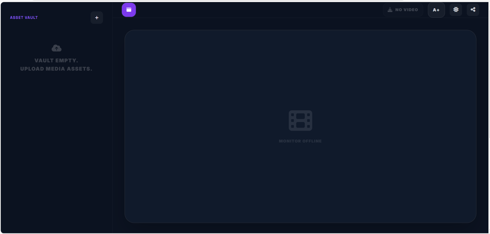
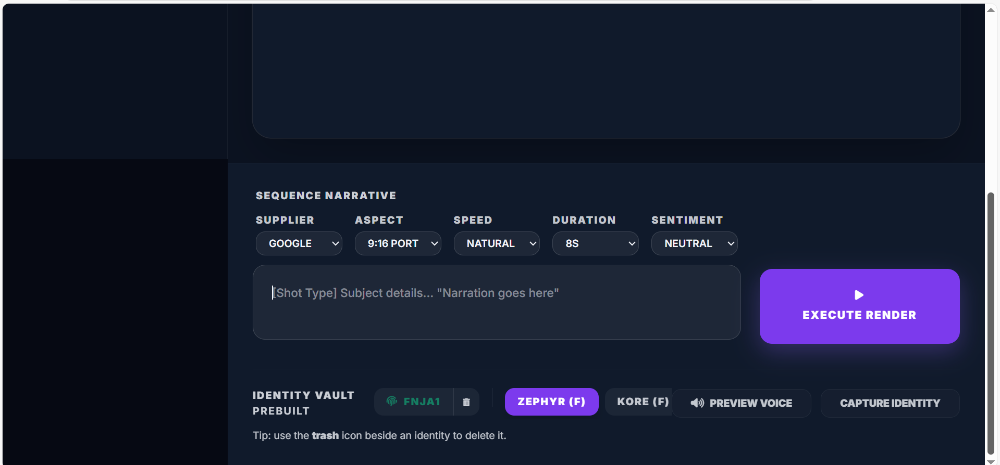
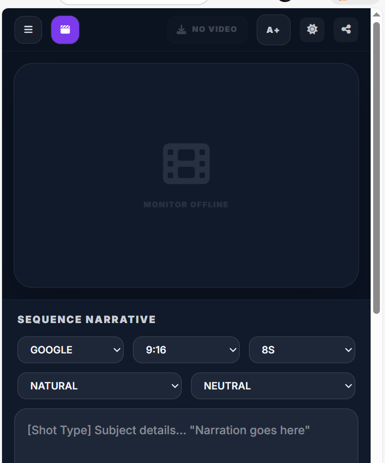
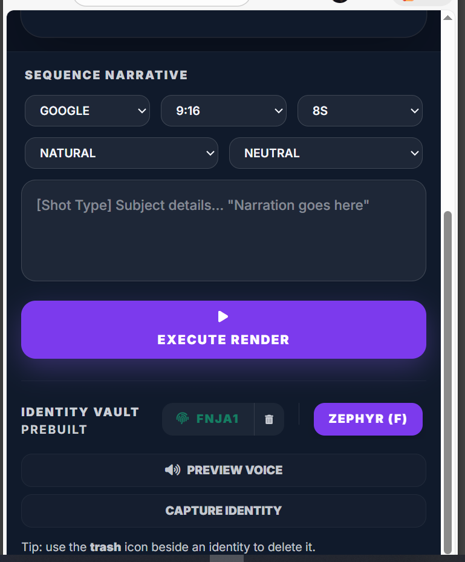
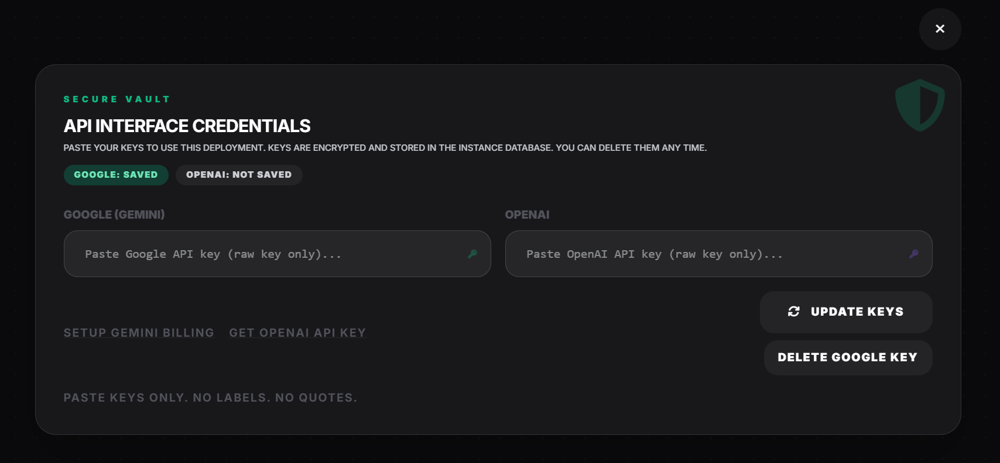
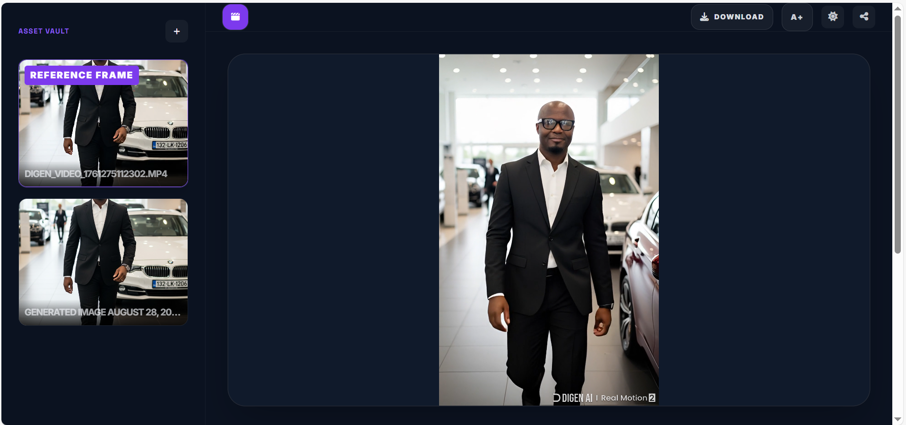

# VisionDirector 
## Knowledgebase (Text/Image → Video Studio)

VisionDirector is a compact studio app for turning **sequence prompts** plus optional **starting media** (images / videos / audio) into short videos, with optional **voice identity capture** and **model routing controls** + optional sequence video extension.

This document is the **knowledgebase**: it explains how to get started, how each feature works, and answers the questions people normally ask after first launch.

[](LICENCE)
© Bob Bobga Nti

---

## Contents

- [1) Official deployment target: Docker](#1-official-deployment-target-docker)
- [2) Quick start (Docker)](#2-quick-start-docker)
- [3) Local development (optional)](#3-local-development-optional)
- [4) How the app works](#4-how-the-app-works)
- [5) Studio walkthrough](#5-studio-walkthrough)
- [6) Asset Vault (desktop + mobile)](#6-asset-vault-desktop--mobile)
- [7) Supplier switching (Google/OpenAI)](#7-supplier-switching-googleopenai)
- [8) API Interface Credentials (Secure Vault)](#8-api-interface-credentials-secure-vault)
- [9) Model Blueprint (Model Map + overrides)](#9-model-blueprint-model-map--overrides)
- [10) Voice identities](#10-voice-identities)
- [11) Downloading outputs](#11-downloading-outputs)
- [12) Themes and UI scale](#12-themes-and-ui-scale)
- [13) Data storage and security](#13-data-storage-and-security)
- [14) Backend API reference](#14-backend-api-reference)
- [15) Troubleshooting](#15-troubleshooting)
- [16) FAQ](#16-faq)
- [17) Repo structure](#17-repo-structure)
- [18) Planned features](#18-planned-features)

---

## 1) Official deployment target: Docker

Your **official** deployment target is **Docker**, using the provided multi-stage `Dockerfile`:

- Stage 1: builds the UI bundle (`npm run build`)
- Stage 2: installs Python dependencies and runs the Flask app with **Gunicorn**:
  - `gunicorn -b 0.0.0.0:${PORT:-8080} app:app`

This is compatible with environments like **Google Cloud Run**, where the platform provides the `PORT` environment variable.

---

## 2) Quick start (Docker)

### 2.1 Build

From the repo root (where the `Dockerfile` is):

```bash
docker build -t visiondirector .
```

### 2.2 Run (local)

```bash
docker run --rm -p 8080:8080 visiondirector
```

Open:

- `http://localhost:8080`

### 2.3 Persist your database + encryption key (recommended)

VisionDirector stores settings and encrypted API credentials in SQLite. To keep these across container restarts, mount a volume.

By default the app writes under:

- `data/syntaxmatrixdir/db.sqlite`
- `data/syntaxmatrixdir/.vd_master_key` (encryption master key)

Recommended run command:

```bash
docker run --rm -p 8080:8080   -v "$(pwd)/data:/app/data"   visiondirector
```

If you prefer an explicit database location:

```bash
docker run --rm -p 8080:8080   -e DATABASE_PATH=/app/data/syntaxmatrixdir/db.sqlite   -v "$(pwd)/data:/app/data"   visiondirector
```

### 2.4 Cloud Run note

Cloud Run sets `PORT`. Your container command already binds to it:

- `0.0.0.0:${PORT:-8080}`

So you normally do not need to set `PORT` yourself.

---

## 3) Local development (optional)

Docker is the official target. Local dev is useful for quick changes.

### 3.1 Build the UI bundle

The app serves a compiled `index.js`. When you edit `.tsx`, rebuild:

```bash
npm install
npm run build
```

### 3.2 Run the Flask server

```bash
python app.py
```

Open:

- `http://localhost:8080`

> If you run a Node/Express static server, you may not have the full `/api/*` backend features unless that server also proxies to Flask.

---

## 4) How the app works

VisionDirector has three layers:

1) **Studio UI (React)**  
   The main interface where you:
   - pick a Supplier (Google/OpenAI)
   - write your sequence prompt
   - upload/select media in the Vault
   - render video

2) **Backend API (Flask)**  
   Provides persistence and secure storage via `/api/*` endpoints:
   - settings (supplier/theme/ui-scale)
   - encrypted API credentials
   - model overrides
   - voice identities

3) **Provider layer (frontend services)**  
   Chooses a provider based on Supplier:
   - Google provider: Gemini/Veo flow
   - OpenAI provider: OpenAI models (including video generation where configured)

Typical render flow:

1) You choose Supplier + settings
2) You provide a sequence prompt (and optionally a starting image/video/audio)
3) The provider optionally parses prompt, optionally generates an image, optionally analyses voice
4) The provider generates a video
5) Output video appears in Preview and is added to the Vault

---

## 5) Studio walkthrough

### 5.1 Controls (top bar)

### Screenshot — Studio landing (desktop)




You will see:

- **Supplier**: Google / OpenAI
- **Speed**: narration delivery speed
- **Sentiment**: narration style
- **Aspect**: 9:16 portrait, 16:9 landscape, 1:1 square (depending on build options)

These settings steer prompt formatting and which models are used.

### 5.2 Sequence Narrative (main editor)

This is your primary input. A recommended style is shot directions plus narration.

Example:

```text
[Wide shot] A rain-soaked Dublin street at night. Neon reflections. Slow dolly-in.
[Close-up] A developer checks system logs, focused and calm.

"Narration: AI pilots are easy. Keeping AI reliable is hard."
```

Tips:

- Shorter prompts are easier to iterate on.
- If you want a silent video, omit narration.

### 5.3 Execute Render

- If your selected asset is an **image** (or none), the app generates a fresh video.
- If your selected asset is a **video**, the app enters **Extension mode** (continue the clip).

---

## 6) Asset Vault (desktop + mobile)

The Asset Vault is your working set of media. It supports:

- **Image uploads** (PNG/JPG/WebP)
- **Video uploads** (MP4/MOV/WebM as supported by your browser/build)
- **Audio uploads** (WAV/MP3/M4A as supported by your browser/build)

### 6.1 Desktop behaviour

- Vault is visible as a panel
- Selecting an item sets it as “active” for render or extension
- Delete removes it from the vault list

### 6.2 Mobile behaviour

- Vault is a **slide-out drawer**
- Use the **hamburger button** to open it
- Use the close button to dismiss it


### Screenshot — Mobile Asset Vault drawer





### 6.3 Using assets during render

- Active **image** → used as the starting frame (image-to-video)
- Active **video** → enables extension/continuation mode
- Active **audio** → can be used for dictation/transcription and voice analysis (where supported)

---

## 7) Supplier switching (Google/OpenAI)

Supplier determines the provider implementation and available models.

- **Google**: Gemini + Veo-style flow
- **OpenAI**: OpenAI models (including video generation where configured)

### 7.1 Default supplier

The default supplier is stored in SQLite:

- table: `app_settings`
- key: `supplier`
- values: `google` or `openai`

### 7.2 Persistence

On change, the UI posts:

- `POST /api/settings/supplier` with `{ "supplier": "google" | "openai" }`

On launch, the UI reads:

- `GET /api/settings/supplier`

---

## 8) API Interface Credentials (Secure Vault)

This panel is where you store API keys safely.

### 8.1 What you can store

- Google API key
- OpenAI API key


### Screenshot — API Interface Credentials




### 8.2 How it’s stored

Credentials are stored in SQLite **encrypted at rest**:

- table: `api_credentials`
- encryption: `cryptography.fernet`
- master key file: `data/syntaxmatrixdir/.vd_master_key`

> Treat the master key file as sensitive. If it changes, previously stored credentials cannot be decrypted.

### 8.3 How keys are used at runtime

Keys are not permanently stored in the browser. The UI fetches keys when needed and keeps them in memory for provider calls.

---

## 9) Model Blueprint (Model Map + overrides)

Model Blueprint is your “wiring panel” for model selection.

### 9.1 Defaults vs overrides

Defaults come from the shipped registry (e.g. `shared/model_registry.json`).

Overrides are stored in SQLite:

- table: `model_overrides`
- keyed by `(supplier, model_key)`

If an override is blank, the app uses the default for that capability.

### 9.2 Reset to defaults

Resets remove overrides for a supplier:

- `POST /api/model-overrides/<supplier>/reset`

---

## 10) Voice identities

Voice identities allow you to analyse a recording and reuse its characteristics later.

### 10.1 What is stored

- label
- base voice
- traits (the “voice profile” text)
- default speed
- optional sentiment

### 10.2 Endpoints

- `GET /api/voice-identities/<supplier>`
- `POST /api/voice-identities/<supplier>`
- `DELETE /api/voice-identities/<supplier>/<voice_id>`

### 10.3 Preview

The UI can play a short preview using:
- the selected base voice, or
- a captured identity profile

---

## 11) Downloading outputs

VisionDirector includes a **Download** button for the final output.

### Screenshot — Final output + Download button



Typical behaviour:

- If a rendered video is selected, Download saves it to your machine.
- If no video is selected, the button may be disabled or show an error message.

If your browser blocks downloads, check permissions or try a different browser.

---

## 12) Themes and UI scale

These are stored in SQLite under `app_settings`:

- theme: `dark` / `light`
- ui_scale: `normal` / `large`

Endpoints:

- `GET /api/settings/theme` and `POST /api/settings/theme`
- `GET /api/settings/ui-scale` and `POST /api/settings/ui-scale`

---

## 13) Data storage and security

### 13.1 Database location

Default:

- `data/syntaxmatrixdir/db.sqlite`

Optional override:

- `DATABASE_PATH=/path/to/db.sqlite`

### 13.2 What is stored

- `app_settings` — supplier/theme/ui scale
- `api_credentials` — encrypted supplier keys
- `model_overrides` — per-supplier model overrides
- `voice_identities` — saved identities

### 13.3 Backups

For production, back up:

- `db.sqlite`
- `.vd_master_key`

Keep both together. The encrypted credentials depend on the master key.

---

## 14) Backend API reference

### Settings

- `GET  /api/settings/supplier` → `{ supplier }`
- `POST /api/settings/supplier` → `{ supplier }`

- `GET  /api/settings/theme` → `{ theme }`
- `POST /api/settings/theme` → `{ theme }`

- `GET  /api/settings/ui-scale` → `{ uiScale }`
- `POST /api/settings/ui-scale` → `{ uiScale }`

### Credentials

- `GET    /api/credentials/status`
- `POST   /api/credentials/<supplier>`
- `DELETE /api/credentials/<supplier>`
- `GET    /api/credentials/<supplier>` (internal use)

### Model overrides

- `GET  /api/model-overrides/<supplier>`
- `POST /api/model-overrides/<supplier>`
- `POST /api/model-overrides/<supplier>/reset`

### Voice identities

- `GET    /api/voice-identities/<supplier>`
- `POST   /api/voice-identities/<supplier>`
- `DELETE /api/voice-identities/<supplier>/<voice_id>`

---

## 15) Troubleshooting

### “ai.analyseVoice is not a function”
Cause: the provider method is named `analyzeVoice` (American spelling).

Fix: change calls in `Studio.tsx` from `analyseVoice` to `analyzeVoice`, rebuild, then hard refresh.

### Supplier changes not saved
Checklist:

1) You are running the Docker container (Gunicorn + Flask) or Flask locally
2) `/api/settings/supplier` returns 200 in the browser network tab
3) The database is on a persistent volume (if you expect it to persist across restarts)

### TSX edits not showing up
If you serve `index.js`, you must rebuild:

```bash
npm run build
```

Then restart your server/container.

### “database is locked”
This can happen if multiple processes compete for the same SQLite file. For containers, mount a local volume and avoid multiple replicas pointing to one sqlite file without a coordinating layer.

---

## 16) FAQ

### Does VisionDirector support video uploads?
Yes. Video uploads are a first-class feature (alongside image and audio uploads).

### Is branding/logo management available?
Not yet. Branding is planned for a later release.

### Where is the default supplier saved?
In SQLite (`app_settings.supplier`).

### How do I reset everything?
Stop the server and delete:

- `data/syntaxmatrixdir/db.sqlite`
- `data/syntaxmatrixdir/.vd_master_key`

Restart and re-enter your credentials.

---

## 17) Repo structure

High-value files (typical):

- `components/Studio.tsx` — main Studio UI
- `components/ModelMap.tsx` — Model Blueprint (credentials + overrides)
- `services/aiProvider.ts` — chooses provider and manages fallback
- `services/geminiService.ts` — Google provider implementation
- `services/openaiService.ts` — OpenAI provider implementation
- `data/db.py` — SQLite connection and path management
- `data/credentials.py` — encrypted key storage
- `data/model_registry.py` — model registry + overrides
- `data/voice_identities.py` — voice identity storage
- `shared/model_registry.json` — default models and capabilities

---
